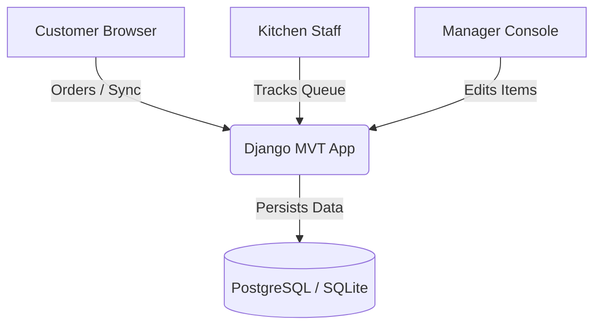

# Smart Restaurant Food Ordering & Kitchen Dashboard

## Overview
The **Smart Restaurant Food Ordering & Kitchen Dashboard** is a premium, end-to-end food ordering and kitchen dispatch system built using Django. It features a customer-facing menu interface, a localStorage-persisted and session-synchronized cart, a transaction-isolated checkout process, secure UUID order tracking, a split-screen Kitchen Dashboard, and a comprehensive Manager operations dashboard with date-range filters, revenue summaries, and category/item management.

## Problem Statement
Modern dining operations struggle with lag times and miscommunications between customers, servers, kitchen staff, and management. Common issues include:
- Unsynchronized orders leading to misplaced tickets.
- Security vulnerabilities where users can access internal dashboards using standard accounts.
- Data integrity failures where deleting a menu item corrupts historical sales records.
- Ephemeral filesystem losses when running uploads on modern cloud hosting services.

## Solution
This application provides a highly synchronized, four-interface system:
- **Customer Interface**: Allows visitors to view, search, filter, and order items.
- **Kitchen Dashboard**: Restricts access to kitchen staff, showing orders sorted by queue time with sequential status progression.
- **Manager Console**: Provides restaurant analytics, category/item creation, and direct menu image uploading.
- **Django Admin**: Provides full superuser management.

## Key Features

### Customer Features
- Responsive category browsing and searching.
- Dynamic cart drawer with immediate subtotal, tax, and total updates.
- Secure checkout forms with atomic session sync.
- Direct UUID order tracking links.
- Persistent Light/Dark theme settings.

### Kitchen Features
- Live split-view tracking of active orders.
- Single-click sequential status transitions (`RECEIVED` -> `PREPARING` -> `READY` -> `COMPLETED`).
- Automatic background polling to ensure dashboard synchronization.

### Manager Features
- Dashboard analytics (Revenue summaries, recent orders lists, item sales performance, category ratios).
- Integrated category management and item editors.
- Direct image file uploads with a local fallback URL system.
- Eligible order cancellation controls.

### Admin Features
- Administrative oversight of categories, items, and roles.
- Image thumbnail rendering directly inside table lists.
- Safe cascading deletion strategies.

### Production Engineering Features
- Liveness and readiness health checks.
- Comprehensive rotating console and file logging.
- Secure production configuration utilizing Environment files and WhiteNoise static asset serving.

## Application Interfaces
1. **Customer Front Window**: Accessible at `/`
2. **Kitchen Operations Console**: Accessible at `/kitchen/`
3. **Manager Operations Console**: Accessible at `/manager/`
4. **Django Site Administrator**: Accessible at `/admin/`

## System Architecture
The application employs a standard Django Model-View-Template (MVT) architecture. Database access is optimized using indexing and select-related joins to minimize SQL querying overhead. Frontend interactivity is implemented using modern Bootstrap 5 and Vanilla JS.



## Application Workflow
1. **Browse & Cart**: Customer views items, adds to local storage cart, and syncs session state.
2. **Checkout**: Customer submits order; server validates price databases inside an atomic transaction.
3. **Queue**: Order appears on Kitchen Dashboard.
4. **Dispatch**: Kitchen updates order status. Live polling keeps the Customer tracking page up to date.
5. **Analytics**: Managers monitor order metrics, revenue aggregates, and menu stats.

## Technology Stack
- **Backend Framework**: Python 3, Django 5.x
- **Frontend Framework**: HTML5, Vanilla CSS, Vanilla JavaScript, Bootstrap 5, Bootstrap Icons
- **Database Engine**: PostgreSQL (Production) / SQLite (Development)
- **Asset Serving**: WhiteNoise (Static Files Serving)
- **Image Processing**: Pillow 12.x

## Project Structure
```
├── restaurant/                 # Core app code
│   ├── management/             # Custom commands
│   ├── migrations/             # Migration files
│   ├── static/                 # CSS/JS resources
│   ├── templates/              # HTML layout templates
│   ├── tests/                  # Test suites
│   ├── admin.py                # Admin declarations
│   ├── forms.py                # Django Forms
│   ├── models.py               # DB Models
│   ├── urls.py                 # Route URLs
│   └── views.py                # App View controllers
├── restaurant_project/         # Settings configuration package
├── media/                      # Uploaded menu images (ignored)
├── requirements.txt            # Dependency list
├── render.yaml                 # Deployment file
└── .env.example                # Config parameters
```

## Database Schema
Models details:
- **Category**: `name` (unique string), `slug`.
- **MenuItem**: `name`, `description`, `price` (Decimal), `image` (upload path), `image_url` (external fallback URL), `is_available` (indexed boolean).
- **Order**: `tracking_uuid` (indexed UUID), `customer_name`, `customer_phone`, `status` (indexed string), `subtotal_amount`, `tax_amount`, `total_amount`.
- **OrderItem**: References `Order` and `MenuItem` (`on_delete=models.SET_NULL`). Stores `price_at_order`, `item_name_at_order`, and `category_name_at_order` snapshots.

## Data Integrity Architecture
When a menu item is deleted, the system uses `models.SET_NULL` on the referencing `OrderItem`. To prevent broken sales reports, the name, category, and unit price of the item are copied into historical snapshot columns on the `OrderItem` at checkout time. Financial metrics (subtotals, tax rates, and totals) are recorded as raw decimals on the `Order` model directly.

## Authentication and Role Separation
- **Kitchen Dashboard**: Protected by the `@kitchen_required` decorator, which redirects users who are not part of the `Kitchen Staff` group to `/kitchen/login/`.
- **Manager Dashboard**: Protected by the `@manager_required` decorator, which redirects users who are not part of the `Managers` group to `/manager/login/`.
- **Django Admin**: Protected by superuser checks.

## Cart Architecture
The cart stores items inside browser `localStorage` to ensure immediate UI rendering and persistence. Changes are synchronized to the backend via async `POST` requests to `/cart/sync/`, which stores data in `request.session`. Before checkout, the system validates database prices and availability.

## Order Tracking Architecture
Customer tracking is mapped via UUID URLs (e.g., `/tracking/<uuid>/`). This prevents sequential ID enumeration attacks. The page polls the backend status API dynamically, using a request buffer to prevent network bottlenecks.

## Menu Image Upload Architecture
Managers can upload images locally or provide external image URLs:
- **Validators**: Files must be JPEGs, PNGs, or WebPs under **5 MB**, verified using Pillow.
- **Fallback Property**: `display_image_url` prioritized `image.url`, then `image_url`, and defaults to a local placeholder image.

## Light and Dark Mode
A centralized theme system is implemented via custom variables inside [style.css](file:///c:/Users/91934/Documents/FSD%20-%20Internship%20Tasks/Smart-Restaurant-Ordering-System/restaurant/static/restaurant/css/style.css).
- Theme toggles are located inside navigation bars.
- Selections are stored inside browser `localStorage`.
- Settings initialize early inside the HTML `<head>` tag to prevent a "theme flash" on page load.

## Manager Analytics
The dashboard computes operational statistics on the fly:
- **Revenue Statistics**: Total sales, active counts, and cancelled totals.
- **Top Menu Items**: Displays item orders count in descending order.
- **Category Popularity**: Visual breakdown of orders per category.
- **Date Filtering**: Supports narrowing metrics by date ranges.

## Installation
1. Clone the repository.
2. Initialize virtual environments:
   ```bash
   python -m venv venv
   .\venv\Scripts\activate
   ```
3. Install dependencies:
   ```bash
   pip install -r requirements.txt
   ```

## Environment Configuration
Create a `.env` file from the sample file:
```bash
copy .env.example .env
```
Supply your own configuration keys (e.g., database connection URLs).

## Database Setup
1. Create and apply database migrations:
   ```bash
   python manage.py makemigrations
   python manage.py migrate
   ```

## Seed Data
Seed initial categories and menu items:
```bash
python manage.py seed_menu
```
Generate staff roles and test logins:
```bash
python manage.py create_demo_users
```

## Running the Application
Run the local development server:
```bash
python manage.py runserver
```

## Application URLs
- **Menu Browsing**: `http://127.0.0.1:8000/`
- **Kitchen Dashboard**: `http://127.0.0.1:8000/kitchen/`
- **Manager Console**: `http://127.0.0.1:8000/manager/`
- **Django Admin**: `http://127.0.0.1:8000/admin/`

## Testing
Run the automated test suite:
```bash
python manage.py test
```

## CI/CD
A GitHub Actions workflow runs migrations checks, syntax validation, and executes the full test suite on push/pull requests to the `main` branch.

## Health Checks
- **Liveness API**: `/health/live/` returns `200 OK`.
- **Readiness API**: `/health/ready/` validates the database connection status.

## Logging
Logging outputs are formatted and rotated inside `logs/restaurant.log`. Critical events (checkout operations, cancellation records, database retries, and errors) are logged with stack traces.

## Production Deployment
The application is pre-configured for deployment on Render. `render.yaml` outlines the target blueprints. Production builds serve static files via WhiteNoise.

## Production Media Storage
Render environments use ephemeral filesystems. In production, connect external cloud storage (such as Amazon S3 or Cloudinary) by adding Django storage backends (e.g., `django-storages` or `cloudinary-storage`) and configuring the appropriate keys in your `.env` settings.

## Production Validation
Run deployment check flags:
```bash
python manage.py check --deploy
```

## Screenshots
*(Refer to local screenshots for interface previews.)*

## Current Project Status
- System Classification: **DEPLOYMENT READY**
- Migration status: Applied up to `0008_menuitem_image`
- Unit tests: 148 / 148 tests passing (100%)

## Known Limitations
- Media file uploads use local storage by default, meaning uploads are lost when Render containers restart. Cloud media integration settings must be supplied in production.

## Future Improvements
- Integrate standard Cloudinary storage adapters.
- Implement Django Channels / Redis to support real-time status updates via WebSockets instead of client polling.

## Documentation
- Detailed configurations and runtime settings are documented in `OPERATIONS.md`.
- Historical implementation logs are tracked in `PROJECT_STATUS.md`.

## License
The project is licensed under the MIT License.

## Author
SmartDine Engineering Team.
