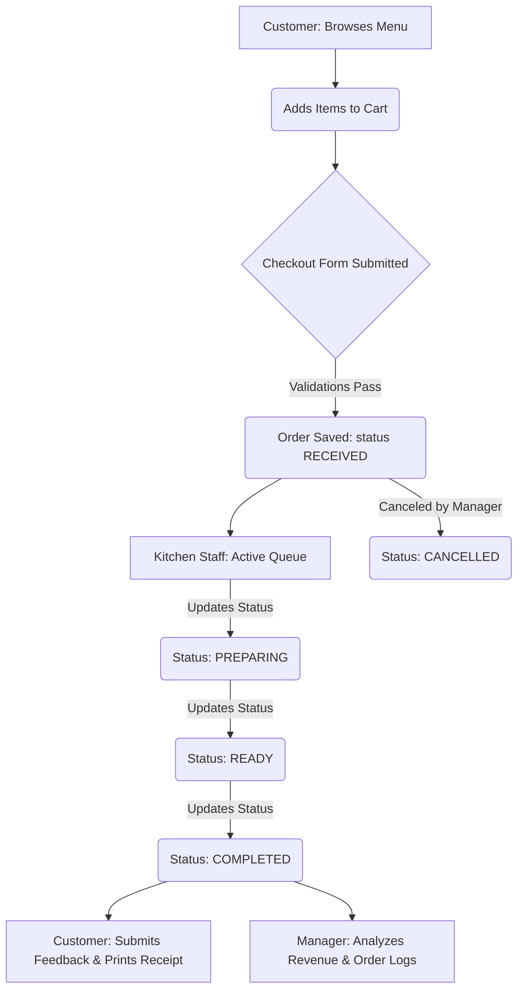
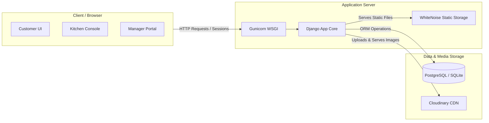
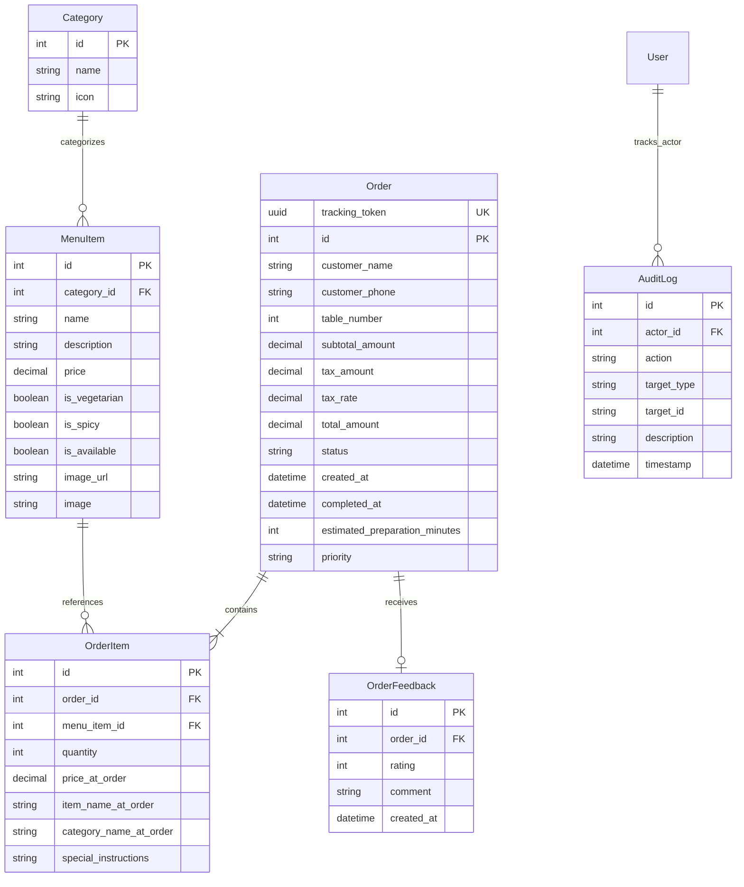

# SmartDine – Smart Restaurant Ordering System

SmartDine is a premium, full-stack Django web application designed to streamline restaurant operations and elevate the customer dining experience. By integrating a seamless customer-facing ordering workflow, a real-time kitchen dispatch console, a robust manager operations portal, and a digital receipt engine, SmartDine serves as a complete digital operating system for modern hospitality.

[](https://www.python.org/)
[](https://www.djangoproject.com/)
[](https://www.postgresql.org/)
[](https://getbootstrap.com/)
[](https://developer.mozilla.org/en-US/docs/Web/JavaScript)
[](https://cloudinary.com/)
[](https://render.com/)

* **Live Application URL**: [https://smart-restaurant-ordering-system-sk0j.onrender.com/](https://smart-restaurant-ordering-system-sk0j.onrender.com/)
* **GitHub Repository**: [https://github.com/anok-bodipogu-79/Smart-Restaurant-Ordering-System](https://github.com/anok-bodipogu-79/Smart-Restaurant-Ordering-System)

---

## 1. Project Overview

SmartDine unifies disjointed restaurant processes into a single, unified hospitality platform. Traditional restaurants face communication gaps between front-of-house customer ordering, back-of-house food preparation, and management oversight. SmartDine bridges this gap by offering:
- **Customers**: Interactive menu browsing, filtering, search, session-based cart management, and real-time order tracking using unique, secure tracking tokens.
- **Kitchen Staff**: A chronological, ticket-based Kitchen Display System (KDS) showing active orders and processing them through a strict, sequential status state machine.
- **Managers**: Centralized operations management featuring a premium forest-green dashboard, live revenue and prep metrics, inventory controls, and immutable system audit logs.

The system is styled under the **SmartDine Premium Hospitality UI** design language—an elegant theme characterized by warm minimalism, editorial serif typography, structured Bento-style grids, deep forest green primary elements (`#0F3325`), and burnished gold accents.

---

## 2. Live Demo Access

The deployed application is live and open for review.

* **URL**: [https://smart-restaurant-ordering-system-sk0j.onrender.com/](https://smart-restaurant-ordering-system-sk0j.onrender.com/)
* **Demo Staff Credentials**:
  * **Username**: `demo`
  * **Password**: `demopass`

### Access Steps:
1. Open the application landing page and click **Browse Menu**.
2. Scroll to the footer of the menu page.
3. Click the **Staff Access** link under the logo/navigation links.
4. Select either **Kitchen Console** or **Manager Portal**.
5. Log in using the `demo` / `demopass` credentials.

> [!IMPORTANT]
> **Evaluation Security Note**: The credentials above are restricted demo credentials created specifically for application evaluation and testing. Do not expose administrative passwords or production database variables in the codebase.

---

## 3. Application Roles

| Role | Main Purpose | Key Capabilities |
| :--- | :--- | :--- |
| **Customer** | Browser-based ordering & tracking | View menu, search & filter dishes, manage cart, place dine-in/takeaway orders, track progress, download receipts, submit feedback. |
| **Kitchen Staff** | Back-of-house order preparation | View chronological active order queue, update order preparation state, view special instructions, set preparation times. |
| **Manager** | Store operations & business intelligence | Monitor sales metrics (revenue, cancel rate, prep times), manage catalog (menu items, categories, availability), cancel eligible orders, view immutable audit logs, export reports to CSV. |

---

## 4. Core Features

### Customer Experience
- **Interactive Menu**: Fully responsive menu catalog with real-time text query search, dynamic category filtering, and category sliders.
- **Dietary & Heat Indicators**: Explicit badges indicating Vegetarian (`VEG`) and Spicy preferences.
- **Dynamic Sorting**: Sort items on the fly by Price (Low $\rightarrow$ High or High $\rightarrow$ Low), Name (A $\rightarrow$ Z), and Popularity (computed dynamically from historical order volumes).
- **Session-Based Cart**: Persistent browser-side local cart that automatically synchronizes with Django session state to ensure server-side price/availability verification.
- **Dine-In Support**: Optional table selection and mandatory phone number validation utilizing standardized formatting checks.
- **Order Tracking & Feedback**: Unique UUID tracking links allowing customers to monitor order status in real time and submit a 1-to-5 star rating and comment feedback upon order completion.
- **Digital Receipt Engine**: Standard responsive layout-stable receipts formatted for 80mm thermal printers using CSS `@media print` rules.

### Kitchen Operations
- **Chronological Active Queue**: Active orders listed in columns by state (`RECEIVED`, `PREPARING`, `READY`), sorted oldest-first to prevent ticket stagnation.
- **Strict State Machine**: Directional progression of order status. Attempts to bypass intermediate statuses or move orders backward are blocked by backend validations.
- **Chef's Workspace Details**: Visible priority levels (`NORMAL`, `PRIORITY`, `URGENT`), elapsed waiting timers, custom customer instructions, and estimated preparation time configuration.
- **Automatic Polling**: Client-side JavaScript polling to keep the dispatch board up-to-date with active tickets.

### Manager Operations Center
- **Bento Operations Dashboard**: A structured dashboard display tracking core KPIs: Total Revenue, Order Volume, Cancel Rate, and Average Prep Time (calculated dynamically).
- **Menu CRUD Management**: Form-based interfaces for creating, updating, and deleting categories and menu items (including direct file image uploads).
- **Inventory Toggle**: Instant switch to mark items "Available" or "Sold Out" on the customer menu.
- **Immutable System Ledger**: Read-only access to custom system logs recording critical transactions (order placement, status updates, cancellations, price adjustments).
- **CSV Data Export**: One-click download of all transaction details for external spreadsheet analytics.

---

## 5. Application Workflow

The diagram below illustrates the end-to-end order flow from customer placement to manager analytics:



---

## 6. System Architecture

SmartDine is built on a robust server-rendered MTV (Model-Template-View) pattern:



- **Production Server**: Deployed using **Gunicorn** to handle concurrency in combination with **WhiteNoise** for high-efficiency static file compression and caching.
- **Media CDN**: Uses **Cloudinary Storage** in production to persist MenuItem images uploaded by managers, overcoming Render's ephemeral local disk storage.
- **Database**: Django ORM interfaces with SQLite during development and connects dynamically to PostgreSQL in production environments.

---

## 7. Technology Stack

| Layer | Technology |
| :--- | :--- |
| **Backend Framework** | Python 3.11+ / Django 5.x / 6.x |
| **Frontend** | HTML5 / Vanilla CSS3 / JavaScript (ES6) / Bootstrap 5.3.3 |
| **Database** | SQLite (Local Dev) / PostgreSQL (Production) |
| **ORM** | Django Object-Relational Mapper |
| **Media Hosting** | Cloudinary CDN (Production integration via `django-cloudinary-storage`) |
| **Static Assets** | WhiteNoise (Compressed & cached static serving) |
| **Document Generation** | xhtml2pdf (HTML to PDF translation for invoice downloads) |
| **Server Engine** | Gunicorn (Green Unicorn WSGI HTTP Server) |
| **Testing** | Django Unit Test framework (sqlite / Postgres test containers) |

---

## 8. Database Schema & Data Models

The relational database schema is normalized to ensure data integrity and track operational changes:



### Models Purpose
* **Category**: Groups menu offerings (e.g., Appetizers, Main Course, Drinks) with customized dashboard icons.
* **MenuItem**: Represents dishes, storing prices, dietary properties, availability, and Cloudinary media links.
* **Order**: Stores checkout data, dine-in metadata, standard calculations, and tracking coordinates.
* **OrderItem**: Core bridge storing quantity, custom text instructions, and crucial historical data.
* **OrderFeedback**: Captures ratings and text reviews linked directly to completed orders.
* **AuditLog**: Immutable system ledger recording administrative updates, status shifts, and user actions.

---

## 9. Key Engineering Decisions

### 1. Financial Data Immutability
To protect sales analytics, the system snapshots pricing data (`price_at_order`, `item_name_at_order`, `category_name_at_order`) inside `OrderItem` during transaction checkout. If a manager updates an item price or deletes a MenuItem, all past revenue statistics, print layouts, and ledger records remain structurally unaffected.

### 2. Group-Based Custom Authorization Mixins
Instead of relying solely on Django's generic `is_staff` check, custom authentication checks are performed:
- **`KitchenRequiredMixin`**: Validates membership in the "Kitchen Staff" Django Group.
- **`ManagerRequiredMixin`**: Validates membership in the "Managers" Django Group.
Separating staff into explicit groups prevents kitchen operators from accessing managers' portals and vice versa.

### 3. Read-Only Ledger Security
Custom permissions are hardcoded on `AuditLog` inside `restaurant/admin.py`:
```python
def has_add_permission(self, request): return False
def has_change_permission(self, request, obj=None): return False
def has_delete_permission(self, request, obj=None): return False
```
This restricts audit log tampering, even for django admin superusers.

---

## 10. Local Installation & Configuration

### Prerequisites
* Python 3.10+
* Virtualenv package

### Setup Steps:
1. **Clone the Repository**:
   ```bash
   git clone https://github.com/anok-bodipogu-79/Smart-Restaurant-Ordering-System.git
   cd Smart-Restaurant-Ordering-System
   ```

2. **Initialize & Activate Virtual Environment**:
   * **Windows**:
     ```powershell
     python -m venv venv
     .\venv\Scripts\Activate.ps1
     ```
   * **macOS / Linux**:
     ```bash
     python3 -m venv venv
     source venv/bin/activate
     ```

3. **Install Project Dependencies**:
   ```bash
   pip install -r requirements.txt
   ```

4. **Setup Local Environment Variables**:
   * Copy the sample configuration:
     ```bash
     # Windows PowerShell
     Copy-Item .env.example .env
     # macOS / Linux
     cp .env.example .env
     ```
   * Adjust values inside `.env` if using external Postgres databases or Cloudinary accounts. In local development, database defaults to SQLite and storage defaults to the filesystem when variables are omitted.

5. **Run Migrations**:
   ```bash
   python manage.py migrate
   ```

6. **Seed Initial Menu & Categories**:
   ```bash
   python manage.py seed_menu
   ```

7. **Create Demo Accounts**:
   ```bash
   python manage.py create_demo_users
   ```
   *Creates a default kitchen user (`kitchen_demo` / `kitchenpass123`) and manager user (`manager_demo` / `managerpass123`).*

8. **Start the Development Server**:
   ```bash
   python manage.py runserver
   ```
   * Access Customer Menu: `http://127.0.0.1:8000/menu/`
   * Access Staff Gateway: `http://127.0.0.1:8000/staff-access/`

---

## 11. Environment Variables Configuration

| Variable | Purpose | Required in Prod | Default |
| :--- | :--- | :--- | :--- |
| `SECRET_KEY` | Encryption key used for Django signatures | **Yes** | Fallback in development |
| `DEBUG` | Toggle development error output messages | No | `True` |
| `DATABASE_URL` | PostgreSQL database connection string | **Yes** | SQLite file |
| `ALLOWED_HOSTS` | List of allowed network interface domains | No | `localhost,127.0.0.1` |
| `CSRF_TRUSTED_ORIGINS` | Permitted domains for cross-site request validation | **Yes** | Empty |
| `ADMIN_USERNAME` | Automated superuser username | No | Empty |
| `ADMIN_EMAIL` | Automated superuser email address | No | Empty |
| `ADMIN_PASSWORD` | Automated superuser login password | No | Empty |
| `CLOUDINARY_CLOUD_NAME` | Cloudinary storage account cloud directory | **Yes** | Empty (Dev writes local disk) |
| `CLOUDINARY_API_KEY` | Cloudinary storage credential identifier | **Yes** | Empty (Dev writes local disk) |
| `CLOUDINARY_API_SECRET` | Cloudinary storage secure password | **Yes** | Empty (Dev writes local disk) |

---

## 12. Testing Infrastructure

The project comes with a comprehensive suite of unit and integration tests.

### Running Tests:
```bash
python manage.py test
```
The test suite validates:
- **Authentication**: Strict login restriction and mixin protection.
- **Workflow State Machine**: Transitions between order states and boundary rules.
- **Cart Sync Logic**: Integrity between browser-side LocalStorage and Django backend sessions.
- **Analytics calculations**: Date range filtering logic and metric sums.

---

## 13. Production Deployment

This project is pre-configured for automated deployment to **Render** via [render.yaml](file:///c:/Users/91934/Documents/FSD%20-%20Internship%20Tasks/Smart-Restaurant-Ordering-System/render.yaml).

### How to Deployed:
1. Connect your GitHub repository to Render.
2. Render will automatically detect `render.yaml` and provision:
   * A Python web service running **Gunicorn** to run the WSGI application.
   * A PostgreSQL database.
3. The build command will install dependencies, collect static files, apply migrations, and create the administrator account.
4. Set required variables (`ALLOWED_HOSTS`, `CSRF_TRUSTED_ORIGINS`, `CLOUDINARY_CLOUD_NAME`, `CLOUDINARY_API_KEY`, `CLOUDINARY_API_SECRET`) in the Render environment settings dashboard.

---

## 14. Screenshots

*(Screenshots can be generated and placed inside the repository's `docs/` directory. Visual previews of the Customer Menu, Kitchen Console, and Manager Portal interfaces are available on the live deployment: [https://smart-restaurant-ordering-system-sk0j.onrender.com/](https://smart-restaurant-ordering-system-sk0j.onrender.com/))*

---

## 15. Future Enhancements
- **Real-time Synchronization**: Integrate WebSockets using Django Channels and Redis to update the Kitchen queue and order tracking page immediately without client-side polling.
- **Payments Gateway**: Integrate Stripe or Razorpay to process actual customer checkout transactions.
- **Table QR Ordering**: Automatically assign and lock `table_number` based on scanned QR codes.
- **Customer Profiles**: Allow returning customers to view historical orders, track points, and save favorite items.

---

## 16. Author
* **Name**: Bodipogu Anok
* **Course**: B.Tech – Artificial Intelligence & Data Science
* **Institution**: Velagapudi Ramakrishna Siddhartha Engineering College
* **GitHub Profile**: [https://github.com/anok-bodipogu-79](https://github.com/anok-bodipogu-79)

---

## 17. Acknowledgment
This application was developed as a comprehensive final project demonstrating full-stack engineering skills, database optimization, role-based access management, and modern design implementation during a **Full Stack Web Development Internship**.
